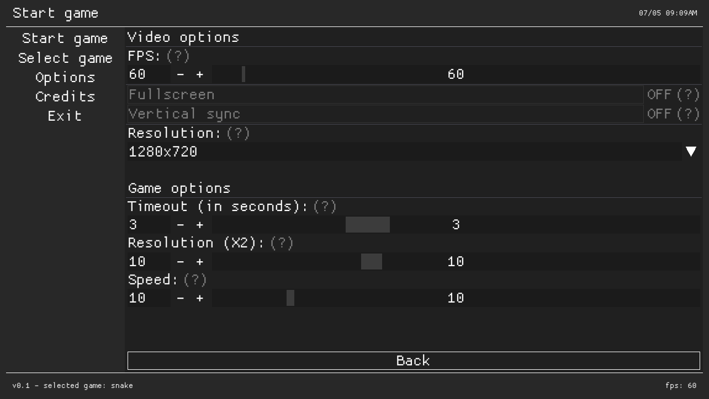
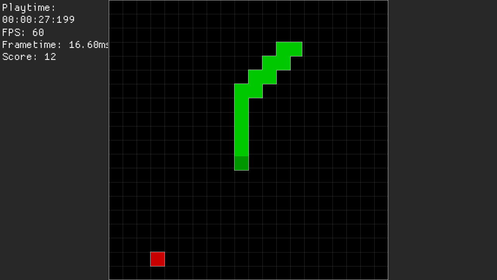

# cpp-retro-games
Retro games made by Steven Kelly in C++. Supports Windows, Linux and the Nintendo Switch.

# Games
* Snake
* Pingpong
* More games soon™

# Compiling
## Windows
* MinGW and DirectX SDK required

## Linux
* GLFW and an OpenGL Loader required

## Nintendo Switch
* ONLY works on Switches with custom firmware installed
* devkitpro is required with installed Switch support. Also needs EGL, glad and gladpi libraries installed

# Notes
* This is developed in Visual Studio Code. I've included my own .vscode directory, which may not work for you
* To change the target platform to build and test, change PLATFORM_X to PLATFORM_WINDOWS/LINUX/NS in .vscode/c_cpp_properties.json
* Only 16:9 resolutions are supported at the moment. I'll look into changing that in the future.

# Credits
* ocornut - [Dear ImGui](https://github.com/ocornut/imgui "Link to library")
* devkitpro/libnx - [compiler toolchain/SDK for the Switch](https://devkitpro.org/wiki/Getting_Started "Link to website")
* [RetroArch](https://www.retroarch.com/ "Link to website") - Design inspiration
* nlohmann - [JSON library](https://github.com/nlohmann/json "Link to library")
* chelle19 - [Ding sound (freesound.org)](https://freesound.org/people/chelle19/sounds/320201/ "Link to sound")
* crisstanza - [Pause sound (freesound.org)](https://freesound.org/people/crisstanza/sounds/167127/ "Link to sound")
* InspectorJ - [Chewing, Breadstick, Single, E.wav (freesound.org)](https://freesound.org/people/InspectorJ/sounds/429598/ "Link to sound")
* Microsoft - DirectX SDK (Windows backend) + Win32API
* GLFW - Linux backend
* SFML - Sound library for Windows and Linux
* SDL2 - Sound library for the Switch
* Probably various other things I forgot - feel free to contact me though

# Images

